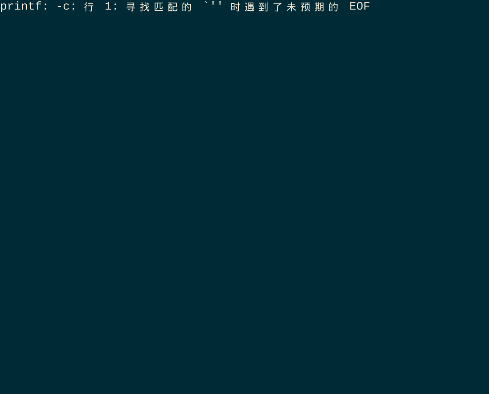

<p align="center"></p>

<h1 align="center">seia</h1>

<p align="center"><strong>Multi-engine web search</strong></p>

<div align="center">

[](./LICENSE)
[](https://docs.rs/seia)
[](https://github.com/celestia-island/seia/actions/workflows/checks.yml)
[](https://seia.docs.celestia.world)

</div>

<div align="center">
**English** ·
[简体中文](./docs/zhs/README.md) ·
[繁體中文](./docs/zht/README.md) ·
[日本語](./docs/ja/README.md) ·
[한국어](./docs/ko/README.md) ·
[Français](./docs/fr/README.md) ·
[Español](./docs/es/README.md) ·
[Русский](./docs/ru/README.md) ·
[العربية](./docs/ar/README.md)

</div>

## Introduction

seia is a multi-engine web search library and CLI. It provides a unified
interface to query diverse search backends. Engines that do not require
authentication work out of the box with zero configuration.

## Quick Start

### CLI

```bash
# Basic search (no API key required)
seia search "rust async patterns"

# Choose a specific engine
seia search "Klein bottle" --engine wikipedia

# JSON output
seia search "climate change" --json

# Through a proxy
HTTPS_PROXY=http://localhost:7890 seia search "hello world"
```

### Library

```rust
use seia::{SearchClient, Engine};

let client = SearchClient::new();
let results = client.search("rust async", Engine::Wikipedia).await?;
```

## Development

```bash
just ci          # fmt-check + clippy + test
just test        # cargo test
just test-proxy  # run tests through localhost:7890 proxy (see tests/README)
```

## Supported Search Engines

| Engine | Auth |
|--------|------|
| [DuckDuckGo](https://duckduckgo.com/) | None |
| [Wikipedia](https://www.mediawiki.org/wiki/API:Search) | None |
| [SearXNG](https://docs.searxng.org/) | `SEARXNG_URL` |
| [Tavily](https://docs.tavily.com/) | `TAVILY_API_KEY` |
| [Bing](https://learn.microsoft.com/en-us/bing/search-apis/bing-web-search/) | `BING_SEARCH_API_KEY` |
| [Brave](https://api.search.brave.com/app/documentation) | `BRAVE_SEARCH_API_KEY` |
| [秘塔 (MetaSo)](https://metaso.cn/search-api/playground) | `METASO_API_KEY` |
| [智谱 (Zhipu)](https://docs.bigmodel.cn/cn/guide/tools/web-search) | `ZHIPU_API_KEY` |
| [博查 (Bocha)](https://open.bochaai.com/docs) | `BOCHA_API_KEY` |


<details>
<summary>Screenshots</summary>

<p align="center"></p>

</details>

## License

SySL-1.0 (Synthetic Source License). See [LICENSE](./LICENSE).
